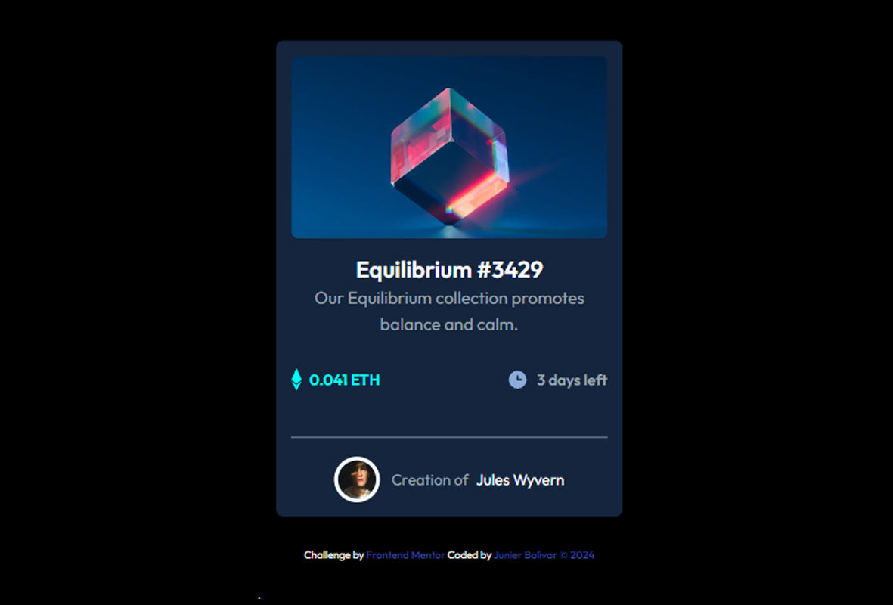

# Frontend Mentor - Product preview card component solution

This is a solution to the [Product preview card component challenge on Frontend Mentor](https://www.frontendmentor.io/challenges/product-preview-card-component-GO7UmttRfa). Frontend Mentor challenges help you improve your coding skills by building realistic projects.

## Table of contents

- [Overview](#overview)
  - [Screenshot](#screenshot)
  - [Links](#links)
- [My process](#my-process)
  - [Built with](#built-with)
  - [What I learned](#what-i-learned)
  - [Continued development](#continued-development)
  - [Useful resources](#useful-resources)
- [Author](#author)
- [Acknowledgments](#acknowledgments)

**Note: Delete this note and update the table of contents based on what sections you keep.**

## Overview

### Screenshot



### Links

- Solution URL: (https://github.com/Junbol-Frontend-Mentor/Product-preview-card-component-HTML-CSS-Responsive)
- Live Site URL: (https://junbol-frontend-mentor.github.io/Product-preview-card-component-HTML-CSS-Responsive/)

## My process

### Built with

-Semantic HTML5 markup
-CSS custom properties
-Flexbox
-Mobile-first workflow
-GIT/GitHub
-PowerShell Command line

### What I learned

Working with peudo-elements

```css
wo .price {
  position: relative; /* Enables positioning of pseudo-elements relative to this element */
  font-size: 2.5rem;
  font-family: 'Fraunces', serif;
  font-weight: 800;
  color: var(--color-Dark-Green);
  padding: 0px; /* Adjust padding as needed */
  /* background-color: aqua; */
}

.price::after {
  content: '$169.99'; /* Old price */
  font-family: 'Montserrat', serif;
  font-weight: 300;
  font-size: 1rem;
  color: var(--color-Black);
  text-decoration: line-through; /* Creates the strike-through effect */
  position: absolute; /* Positions this element out of the normal flow, relative to its nearest positioned ancestor */
  top: 0px; /* This moves the pseudo-element above the container */
  left: 170px; /* Aligns the pseudo-element to the right of the nre price */
  background-color: rgba(255, 255, 255, 0.7); /* Optional background to increase readability */
}

.chart-icon::before {
  font-family: 'Font Awesome 5 Free'; /* This is needed to ensure the correct font is used */
  content: '\f07a'; /* This is the unicode for the fa-chart-bar icon */
  color: white; /* Set the color */
  size: 0.5rem;
  font-weight: 900; /* Font Awesome requires 900 weight for solid icons */
}
```

### Continued development

I would like to continue studying responsive CSS and animation, transitions and FX like parallax.

### Useful resources

- [web.dev](https://web.dev/learn/css) - This helped me for get back on track with CSS.
- [w3schools](https://www.w3schools.com/css/default.asp) - The one place to refresh stuff in practical way.

## Author

- Website - [Junier Bolivar](https://www.bolivarcreativedesign.com)
- Frontend Mentor - [Junbol](https://www.frontendmentor.io/profile/Junbol)
- Twitter - [@JunierBolivar](https://www.twitter.com/@JunierBolivar)

## Acknowledgments
